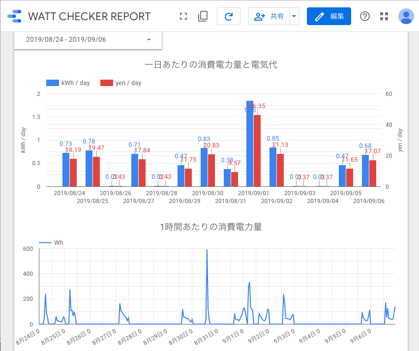

# WATT CHECKER CLIENT

[REX-BTWATTCH1]((http://www.ratocsystems.com/products/subpage/btwattch1.html)) が計測した消費電力をCSVファイル/JSONファイル/BigQueryに保存するツール。


## 出力例

JSON

```
{"datetime": "2019-09-07 09:24:30", "V": 102.931, "mA": 2311.75, "W": 181.385}
{"datetime": "2019-09-07 09:24:31", "V": 102.958, "mA": 2328.9765625, "W": 182.825}
{"datetime": "2019-09-07 09:24:32", "V": 103.074, "mA": 2339.7109375, "W": 184.23}
{"datetime": "2019-09-07 09:24:33", "V": 103.139, "mA": 2351.6875, "W": 185.27}
{"datetime": "2019-09-07 09:24:34", "V": 103.099, "mA": 2348.8203125, "W": 185.045}
```

CSV

```
2019-09-07 09:24:30,102.93,2311.75,181.38
2019-09-07 09:24:31,102.96,2328.98,182.82
2019-09-07 09:24:32,103.07,2339.71,184.23
2019-09-07 09:24:33,103.14,2351.69,185.27
2019-09-07 09:24:34,103.10,2348.82,185.04
```


## 活用事例

エアコンの消費電力の計測データをBigQueryに保存し、データポータルで一日あたりの消費電力量や電気料金を可視化する。




## 機能

- Bluetoothで [REX-BTWATTCH1]((http://www.ratocsystems.com/products/subpage/btwattch1.html)) から計測データを取得する
- 計測データをCSV形式またはJSON形式でファイルに保存する
    - 計測データはメモリにバッファし、一定間隔でファイルに書き出す（デフォルトで3分間隔）
    - 1時間ごとにファイルをローテートし、古いファイルはgzipで圧縮する
- 計測データを1時間ごとにBigQueryにアップロードする


## 動作環境

- [ラトックシステム株式会社 Bluetoothワットチェッカー REX-BTWATTCH1](http://www.ratocsystems.com/products/subpage/btwattch1.html)
- [サンワサプライ株式会社 Bluetooth 4.0 USBアダプタ（Class 2） MM-BTUD44](https://www.sanwa.co.jp/product/syohin.asp?code=MM-BTUD44)
- Raspberry Pi 2 Model B
    - OS: Ubuntu 18.04.2


## インストール＆起動手順

### 1. インストール

依存パッケージをインストールする。

```
sudo apt update && sudo apt upgrade -y
sudo apt install -y python3-pip python3-venv libbluetooth3-dev
```

リポジトリを `/opt/wattchecker-client` にクローンする。

```
sudo git clone https://github.com/j3iiifn/wattchecker-client /opt/wattchecker-client
```

`wattchecker` ユーザを作成し、 `/opt/wattchecker-client` の所有者を変える。

```
sudo adduser --system --group --home /opt/wattchecker-client --no-create-home --shell /bin/false wattchecker
sudo chown -R wattchecker:wattchecker /opt/wattchecker-client
```

venvを作成し、`pybluez`, `crcmod`, `pyyaml`, `google-cloud-bigquery` をインストールする。

```
cd /opt/wattchecker-client
sudo -u wattchecker python3 -m venv venv
sudo -u wattchecker -H venv/bin/pip install wheel
sudo -u wattchecker -H venv/bin/pip install -r requirements.txt
```

設定ファイルを作成する。

```
sudo -u wattchecker cp config_sample.yaml config.yaml
```

`log` ディレクトリを作成する。

```
sudo -u wattchecker mkdir log
```

### 2. Bluetooth ペアリング

`bluetoothctl` コマンドでワットチェッカーとペアリングする。

`bluetoothctl` を実行し、`bluetoothctl` のシェルに入る。

```
bluetoothctl
```

スキャンをONにして、周囲にあるBluetooth機器のMACアドレスを表示する。
`WATT CHECKER` のMACアドレスを探す。

```
agent on
scan on
devices
scan off
```

`WATT CHECKER` のMACアドレスを指定してペアリングする。PINコードは`0000`。

```
pair 00:0C:BF:XX:XX:XX
```

`info` コマンドの出力で `Paired:` が `yes` になっていることを確認する。

```
info 00:0C:BF:XX:XX:XX
```

`bluetoothctl` から出る。

```
exit
```

### 3. systemd設定

```
sudo cp wattchecker_client.service /etc/systemd/system/
sudo systemctl daemon-reload
sudo systemctl enable wattchecker_client.service
sudo systemctl start wattchecker_client.service
```


## 謝辞

Bluetoothワットチェッカー（REX-BTWATTCH1）との通信プログラムは株式会社アットマークテクノ様のサンプルプログラム[1]を参考に実装した。

[1] [Armadillo-IoT G3で「Bluetooth ワットチェッカー」から計測データを表示 | 組み込みLinuxのArmadilloサイト](https://armadillo.atmark-techno.com/howto/armadillo_rex-btwattch1)
